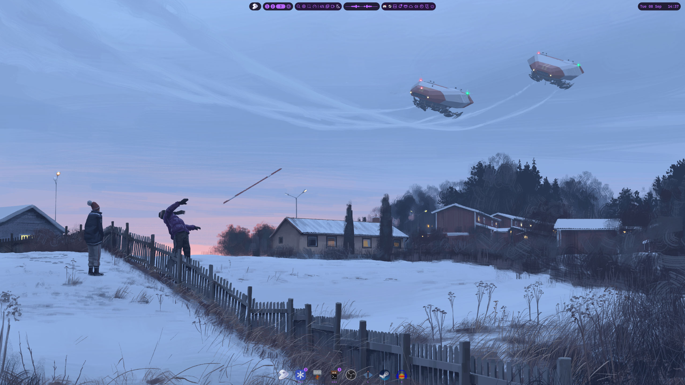
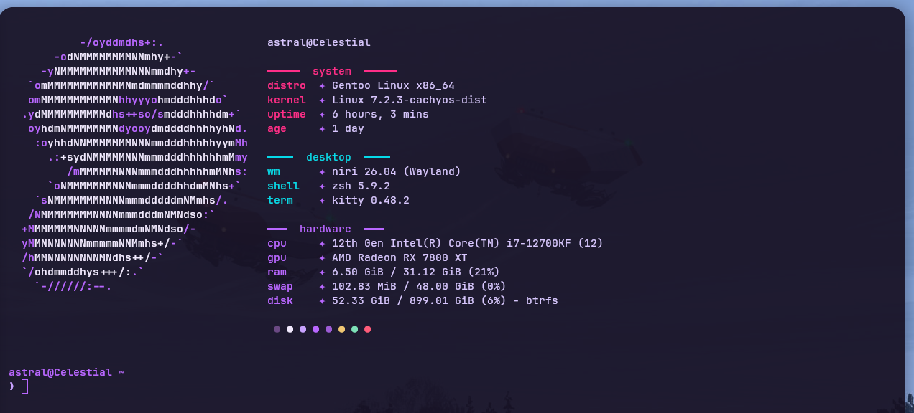

# celestial-setup

Rebuild snapshot for **Celestial** — a hand-built Gentoo gaming / content
workstation running the [niri](https://github.com/YaLTeR/niri) scrolling
compositor with the [Noctalia](https://github.com/Ly-sec/Noctalia) shell, themed
Synthwave.

Everything here is regenerated by [`backup.sh`](backup.sh) and committed as-is —
there is no build step, the files *are* the source of truth. Treat it like a
personal Omarchy: to bring a fresh Gentoo install back to this state, replay the
pieces below.





---

## The machine

| | |
|---|---|
| Profile | `default/linux/amd64/23.0/desktop` — OpenRC, GRUB/EFI, `doas` |
| CPU / GPU | i7-12700KF · Radeon RX 7800 XT (`VIDEO_CARDS="amdgpu radeonsi"`) |
| RAM / FS | 32 GB · btrfs |
| Kernel | `sys-kernel/cachyos-kernel` (`7.2.3-cachyos-dist`) |
| Global `USE` | `vulkan pipewire wayland X -pulseaudio` |
| `CFLAGS` | `-march=native -O2 -pipe`, `MAKEOPTS="-j20 -l20"` |
| Overlays | `guru`, `steam-overlay`, `CachyOS-kernels` |
| Binhost | `getbinpkg` + `binpkg-request-signature` |
| Desktop | SDDM → niri 26.04 → Noctalia 5.x · kitty · zsh + starship |
| Packages | ~1150 installed, 106 in `@world` |

## What's in here

| Path | Contents | Source |
|---|---|---|
| `portage/` | `make.conf`, `package.use/`, `package.mask/`, `package.accept_keywords/`, `repos.conf/`, `binrepos.conf/`, `savedconfig/` | `/etc/portage/` (minus `gnupg/`) |
| `world` | the `@world` set | `/var/lib/portage/world` |
| `pkglist.txt` / `pkglist-names.txt` | every installed package, with / without versions | `qlist -IRCv` / `-ICv` |
| `profile.txt` · `overlays.txt` · `use-flags.txt` · `emerge-info.txt` | profile, enabled repos, resolved `USE`, full build env | `eselect` / `emerge --info` |
| `kernel/config` · `kernel/version` | running kernel `.config` and `uname -a` | `/proc/config.gz` |
| `services.txt` · `services-status.txt` | OpenRC runlevels + current status | `rc-update show` / `rc-status` |
| `system/` | `fstab`, `doas.conf`, `default-grub`, `conf.d/`, `locale.gen`, `lsblk.txt`, `efibootmgr.txt` | `/etc/` |
| `config/` | niri, noctalia, kitty, nvim, fastfetch, yazi, Thunar, obs-studio, MangoHud, gtk-3/4, qt5ct/qt6ct, kde*, starship, pipewire, xdg-desktop-portal … | `~/.config/` (whitelist) |
| `home/` | `.zshrc`, `.zshenv`, `.bashrc`, `.xinitrc`, `.gtkrc-2.0`, … | `~/` (whitelist) |
| `apps.sh` | one-shot installer for the shell/editor stack (zsh, starship, zoxide, neovim, mpv, fonts …) | hand-written |

### Not backed up (on purpose)

Shell histories · `.claude.json` · browser profiles (chromium / helium) · Discord ·
the `gh` OAuth token · emulator save data · screen recordings · OBS logs and the
OBS stream-key file. See [`.gitignore`](.gitignore).

## Restore onto a fresh Gentoo install

1. **Stage 3 + profile** — install the base system, then
   `eselect profile set default/linux/amd64/23.0/desktop`.
2. **Portage config** — copy `portage/*` into `/etc/portage/`. Recreate the
   `make.profile` symlink (target is in `portage/make.profile.target`). Add the
   three overlays from `overlays.txt` with `eselect repository`.
3. **Kernel** — `emerge sys-kernel/cachyos-kernel`, drop `kernel/config` in as
   `.config`, build, install, `grub-mkconfig`.
4. **Packages** — `emerge --ask $(cat pkglist-names.txt)` (or restore `world`
   then `emerge -uDN @world`). The binhost covers most of it.
5. **Services** — re-enable everything in `services.txt`
   (`rc-update add <svc> <runlevel>`).
6. **System files** — merge `system/` back into `/etc/` (review `fstab` UUIDs and
   `default-grub` first).
7. **Dotfiles** — copy `config/` → `~/.config/` and `home/` → `~/` (re-dotting
   the names, e.g. `home/zshrc` → `~/.zshrc`).
8. **Shell stack** — `doas ./apps.sh`.

## Refreshing the backup

```sh
./backup.sh          # re-collect everything into this repo
./backup.sh --push   # …then commit + push
git diff             # review before pushing
```

Runs entirely as `astral` — every source is world-readable, no `doas` needed.
